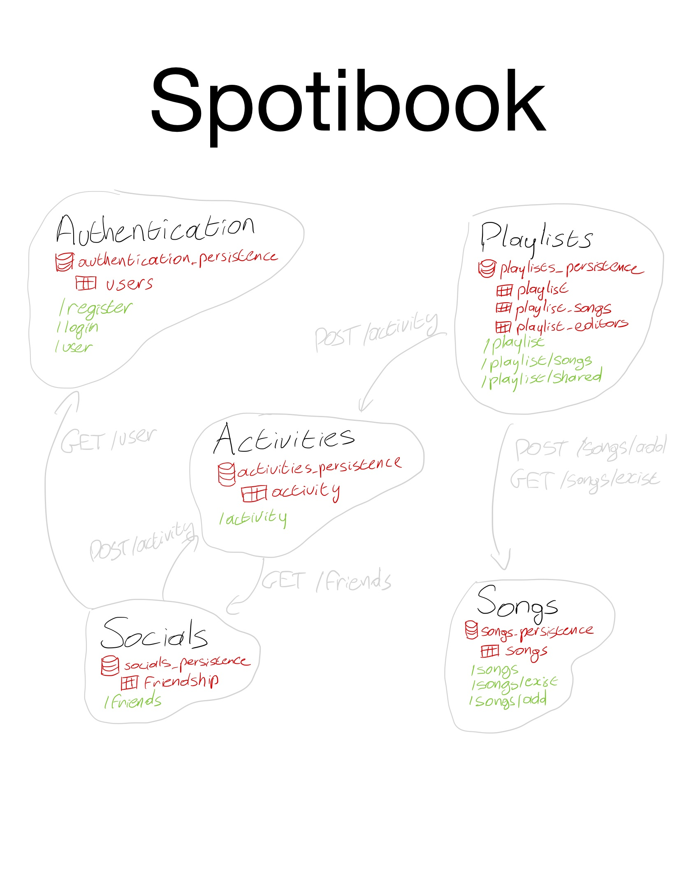

# Spotibook

## Microservices

## API Endpoints

### Activities

#### GET /api/activities
Arguments:
- `user`: The user to display the feed for
- `results`: The number of results to return
This endpoint first queries a list of the current logged in user's friends. It then queries the database for all activities that are owned by the user or any of the user's friends. The response is a list of activities.

#### POST /api/activities
Arguments:
- `user`: The user to create the activity for
- `description`: The description of the activity
This endpoint creates a new activity.

### Register

#### POST /register
Arguments:
- `username`: The username of the user to register
- `password`: The password of the user to register

This endpoint is used to register a new user. It checks if the username already exists in the database, and if not, it creates a new user with the provided username and password.

### Login

#### GET /login
Arguments:
- `username`: The username of the user to login
- `password`: The password of the user to login

This endpoint is used to authenticate a user by checking the provided username and password against the database. If the username and password match, the user is considered logged in.

### User

#### GET /user
Arguments:
- `username`: The username to check existence for

This endpoint is used to check if a user with the provided username exists in the database. It returns `true` if the user exists and `false` otherwise.

### Playlist

#### GET /playlist
Arguments:
- `owner`: The owner of the playlists to retrieve

This endpoint retrieves the playlists owned by the specified user. It returns a list of playlist IDs and names.

#### POST /playlist
Arguments:
- `name`: The name of the playlist to create
- `owner`: The owner of the playlist

This endpoint creates a new playlist with the provided name and owner. If successful, it also logs the action in the activity log.

### PlaylistSongs

#### POST /playlist/songs
Arguments:
- `playlist_id`: The ID of the playlist to add the song to
- `artist`: The artist of the song
- `title`: The title of the song
- `user`: The user performing the action

This endpoint allows a user to add a song to a playlist. It first checks if the song already exists in the database. If not, it adds the song to the `songs` table. Then it adds the song to the specified playlist and logs the action in the activity log.

#### GET /playlist/songs
Arguments:
- `playlist_id`: The ID of the playlist to retrieve the songs from

This endpoint retrieves the songs in the specified playlist. It returns a list of song titles and artists.

### SharedPlaylists

#### POST /playlist/shared
Arguments:
- `playlist_id`: The ID of the playlist to share
- `user`: The user to share the playlist with

This endpoint allows a user to share a playlist with another user. It adds an entry in the `playlist_editors` table to grant access to the shared playlist. It also logs the action in the activity log.

#### GET /playlist/shared
Arguments:
- `user`: The user to retrieve shared playlists for

This endpoint retrieves the playlists shared with the specified user. It returns a list of shared playlist IDs and names.

### Friends

#### GET /friends
Arguments:
- `user`: The user to retrieve friends for

This endpoint retrieves the friends of the specified user. It returns a list of usernames.

#### POST /friends
Arguments:
- `user1`: The first user to establish a friendship
- `user2`: The second user to establish a friendship

This endpoint allows two users to become friends. It checks if the users exist, and if so, it adds an entry in the `friendship` table to establish the friendship. It also logs the action in the activity log.

### AllSongsResource

#### GET /songs
This endpoint retrieves all songs. It returns a list of song titles and artists.

### SongExists

#### GET /songs/exist
Arguments:
- `title`: The title of the song to check existence for
- `artist`: The artist of the song to check existence for

This endpoint checks if a song with the provided title and artist exists in the database. It returns `true` if the song exists and `false` otherwise.

### AddSong

#### POST /songs/add
Arguments:
- `title`: The title of the song to add
- `artist`: The artist of the song to add

This endpoint adds a new song to the database. It checks if the song already exists and if not, it creates a new entry in the `songs` table. If successful, it returns `true`.